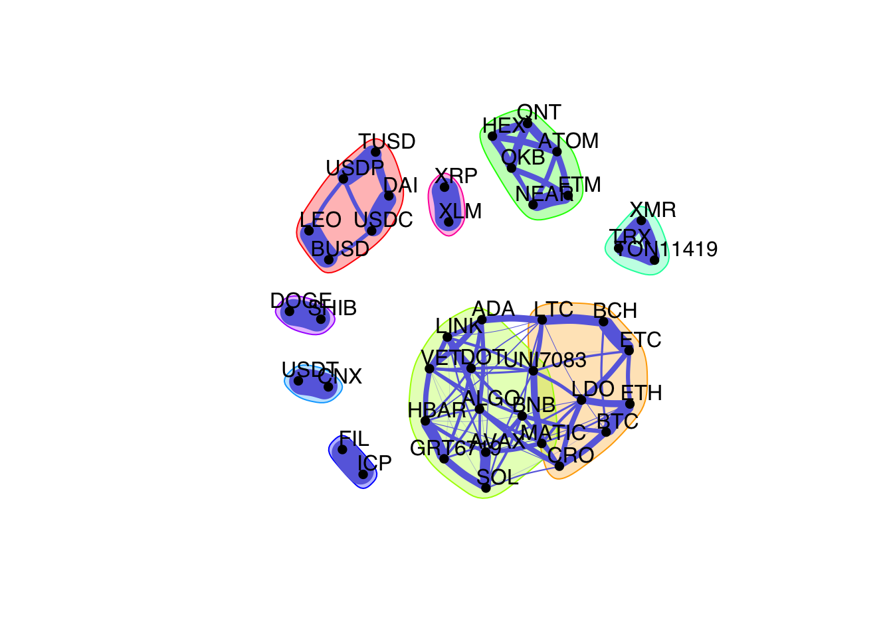

<!-- README.md is generated from README.Rmd. Please edit that file -->

fingraph
========

ADMM-like algorithms for learning graphs from data with applications to
financial markets.

Installation
------------

You can install the development version from GitHub:

``` r
> devtools::install_github("mirca/fingraph")
```

#### Microsoft Windows

On MS Windows environments, make sure to install the most recent version
of `Rtools`.

Usage
-----

### Learning a graph of cryptocurrencies

``` r
library(igraph)
library(fingraph)
library(fitHeavyTail)
library(xts)
set.seed(123)

# load crypto prices into an xts table
crypto_prices <- readRDS("examples/crypto/crypto-prices.rds")
colnames(crypto_prices)
#>  [1] "BTC"   "ETH"   "XRP"   "USDT"  "LTC"   "BCH"   "BNB"   "XLM"   "EOS"  
#> [10] "XMR"   "XEM"   "NEO"   "DASH"  "WAVES" "MIOTA" "ZEC"   "ETC"   "GNO"  
#> [19] "OMG"   "DOGE"  "BAT"   "DCR"   "DGB"   "QTUM"  "REP"   "LSK"   "SC"   
#> [28] "NANO"  "ANT"   "SNT"   "ZEN"   "MAID"  "GNT"   "XVG"   "BNT"   "MONA" 
#> [37] "RLC"   "STORJ" "STEEM" "KMD"   "BTS"

# compute log-returns
log_returns <- diff(log(crypto_prices), na.pad = FALSE)

# estimate a weighted, undirected graph (markov random field)
graph_mrf <- learn_kcomp_heavytail_graph(scale(log_returns),
                                         k = 7,
                                         heavy_type = "student",
                                         nu = fit_mvt(scale(log_returns),
                                                      nu="MLE-diag-resample")$nu,
                                         verbose = FALSE)

# plot network
net <- graph_from_adjacency_matrix(graph_mrf$adjacency,
                                   mode = "undirected",
                                   weighted = TRUE)
cfg <- cluster_fast_greedy(as.undirected(net))
la_kcomp <- layout_nicely(net)
V(net)$label.cex = 1
plot(cfg, net, vertex.label = colnames(crypto_prices),
     layout = la_kcomp,
     vertex.size = 4.5,
     col = "black", 
     edge.color = c("#686de0"),
     vertex.label.family = "Helvetica",
     vertex.label.color = "black",
     vertex.label.dist = 1.25,
     vertex.shape = "circle",
     edge.width = 20*E(net)$weight,
     edge.curved = 0.1)
```



Citation
--------

If you made use of this software please consider citing:

-   [J. V. de M. Cardoso](https://mirca.github.io), [J.
    Ying](https://github.com/jxying), [D. P.
    Palomar](https://www.danielppalomar.com) (2021). [Graphical Models
    in Heavy-Tailed
    Markets](https://palomar.home.ece.ust.hk/papers/2021/CardosoYingPalomar-NeurIPS2021.pdf).
    [Advances in Neural Information Processing
    Systems](https://neurips.cc/Conferences/2021) (NeurIPS’21).

Links
-----

-   [NeurIPS’21
    Slides](https://palomar.home.ece.ust.hk/papers/2021/CardosoYingPalomar-NeurIPS2021-slides.pdf)
-   [NeurIPS’21
    Poster](https://palomar.home.ece.ust.hk/papers/2021/CardosoYingPalomar-NeurIPS2021-poster.png)
-   [NeurIPS’21 Supplementary
    Material](https://palomar.home.ece.ust.hk/papers/2021/CardosoYingPalomar-NeurIPS2021-supplemental.pdf)
