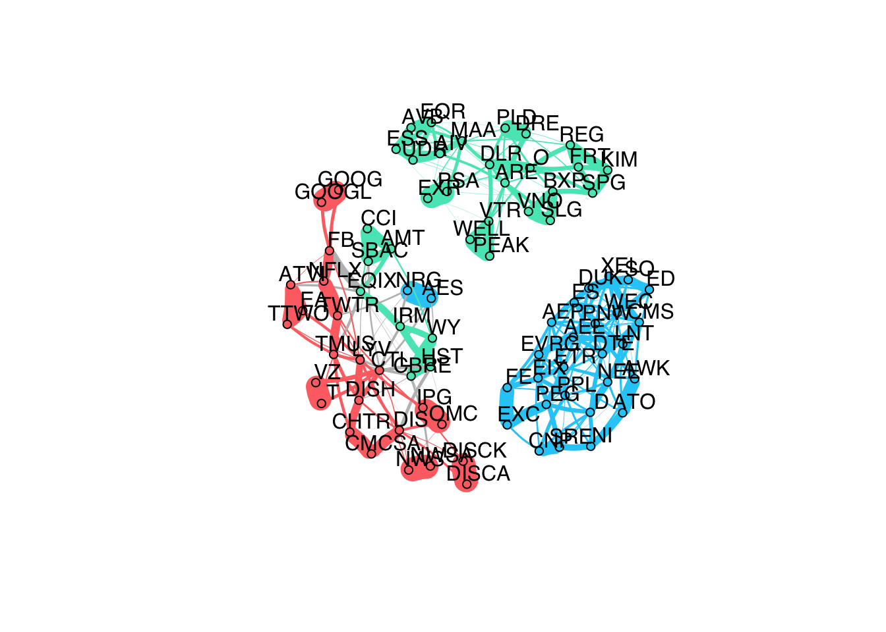

# fingraph
[](https://codecov.io/gh/mirca/fingraph)


This repo contains ADMM implementations to estimate weighted undirected graphs
(Markov random fields) under Student-t assumptions with applications to financial
markets.

## Installation

**fingraph** depends on the development version of **spectralGraphTopology**.

You can install the development version from GitHub:

```r
> devtools::install_github("mirca/spectralGraphTopology")
> devtools::install_github("mirca/fingraph")
```

#### Microsoft Windows
On MS Windows environments, make sure to install the most recent version of ``Rtools``.

## Usage

### Learning a graph of cryptocurrencies

```r
library(igraph)
library(fingraph)
library(fitHeavyTail)
library(xts)
set.seed(123)

# load crypto prices into an xts table
crypto_prices <- readRDS("examples/crypto/crypto-prices.rds")
colnames(crypto_prices)
#>  [1] "BTC"   "ETH"   "XRP"   "USDT"  "LTC"   "BCH"   "BNB"   "XLM"   "EOS"  
#> [10] "XMR"   "XEM"   "NEO"   "DASH"  "WAVES" "MIOTA" "ZEC"   "ETC"   "GNO"  
#> [19] "OMG"   "DOGE"  "BAT"   "DCR"   "DGB"   "QTUM"  "REP"   "LSK"   "SC"   
#> [28] "NANO"  "ANT"   "SNT"   "ZEN"   "MAID"  "GNT"   "XVG"   "BNT"   "MONA" 
#> [37] "RLC"   "STORJ" "STEEM" "KMD"   "BTS"

# compute log-returns
log_returns <- diff(log(crypto_prices), na.pad = FALSE)

# estimate a weighted, undirected graph (markov random field)
graph_mrf <- learn_kcomp_heavytail_graph(scale(log_returns),
                                         k = 7,
                                         heavy_type = "student",
                                         nu = fit_mvt(scale(log_returns),
                                                      nu="MLE-diag-resample")$nu,
                                         verbose = FALSE)

# plot network
net <- graph_from_adjacency_matrix(graph_mrf$adjacency,
                                   mode = "undirected",
                                   weighted = TRUE)
cfg <- cluster_fast_greedy(as.undirected(net))
la_kcomp <- layout_nicely(net)
V(net)$label.cex = 1
plot(cfg, net, vertex.label = colnames(crypto_prices),
     layout = la_kcomp,
     vertex.size = 4.5,
     col = "black",
     edge.color = c("#686de0"),
     vertex.label.family = "Helvetica",
     vertex.label.color = "black",
     vertex.label.dist = 1.25,
     vertex.shape = "circle",
     edge.width = 20*E(net)$weight,
     edge.curved = 0.1)
```


### Learning a network of S&P500 stocks

```r
library(xts)
library(igraph)
library(fingraph)
library(fitHeavyTail)
library(readr)
set.seed(123)

# load table w/ stocks and their sectors
SP500 <- read_csv("examples/stocks/SP500-sectors.csv")

# load stock prices into an xts table
stock_prices <- readRDS("examples/stocks/stock-data-2014-2018.rds")
colnames(stock_prices)
#>  [1] "AEE"   "AEP"   "AES"   "AIV"   "AMT"   "ARE"   "ATO"   "ATVI"  "AVB"  
#> [10] "AWK"   "BXP"   "CBRE"  "CCI"   "CHTR"  "CMCSA" "CMS"   "CNP"   "CTL"  
#> [19] "D"     "DIS"   "DISCA" "DISCK" "DISH"  "DLR"   "DRE"   "DTE"   "DUK"  
#> [28] "EA"    "ED"    "EIX"   "EQIX"  "EQR"   "ES"    "ESS"   "ETR"   "EVRG" 
#> [37] "EXC"   "EXR"   "FB"    "FE"    "FRT"   "GOOG"  "GOOGL" "HST"   "IPG"  
#> [46] "IRM"   "KIM"   "LNT"   "LYV"   "MAA"   "NEE"   "NFLX"  "NI"    "NRG"  
#> [55] "NWS"   "NWSA"  "O"     "OMC"   "PEAK"  "PEG"   "PLD"   "PNW"   "PPL"  
#> [64] "PSA"   "REG"   "SBAC"  "SLG"   "SO"    "SPG"   "SRE"   "T"     "TMUS" 
#> [73] "TTWO"  "TWTR"  "UDR"   "VNO"   "VTR"   "VZ"    "WEC"   "WELL"  "WY"   
#> [82] "XEL"

# compute log-returns
log_returns <- diff(log(stock_prices), na.pad = FALSE)

# estimate a weighted, undirected graph (markov random field)
graph_mrf <- learn_kcomp_heavytail_graph(scale(log_returns),
                                         rho = 10,
                                         k = 3,
                                         heavy_type = "student",
                                         nu = fit_mvt(scale(log_returns),
                                                      nu="MLE-diag-resample")$nu,
                                         verbose = FALSE)
#> Warning in tclass.xts(x): index does not have a 'tclass' attribute

#> Warning in tclass.xts(x): index does not have a 'tclass' attribute

# map stock names and sectors
stock_sectors <- c(SP500$GICS.Sector[SP500$Symbol %in% colnames(stock_prices)])
stock_sectors_index <- as.numeric(as.factor(stock_sectors))

# plot network
net <- graph_from_adjacency_matrix(graph_mrf$adjacency,
                                   mode = "undirected",
                                   weighted = TRUE)
la_kcomp <- layout_nicely(net)
V(net)$label.cex = 1
colors <- c("#FD7272", "#55E6C1", "#25CCF7")
V(net)$color <- colors[stock_sectors_index]
V(net)$type <- stock_sectors_index
V(net)$cluster <- stock_sectors_index
E(net)$color <- apply(as.data.frame(get.edgelist(net)), 1,
                      function(x) ifelse(V(net)$cluster[x[1]] == V(net)$cluster[x[2]],
                                        colors[V(net)$cluster[x[1]]], 'grey'))
plot(net, vertex.label = colnames(stock_prices),
     layout = la_kcomp,
     vertex.size = 4.5,
     vertex.label.family = "Helvetica",
     vertex.label.dist = 1.25,
     vertex.label.color = "black",
     vertex.shape = "circle",
     edge.width = 20*E(net)$weight,
     edge.curved = 0.1)
```



## Citation
If you made use of this software please consider citing:

-   [J. V. de M. Cardoso](https://mirca.github.io), [J. Ying](https://github.com/jxying),
    [D. P. Palomar](https://www.danielppalomar.com) (2021).
    [Graphical Models in Heavy-Tailed Markets](https://palomar.home.ece.ust.hk/papers/2021/CardosoYingPalomar-NeurIPS2021.pdf).
    [Advances in Neural Information Processing Systems](https://neurips.cc/Conferences/2021) (NeurIPS’21).

## Links
- [NeurIPS’21 Slides](https://palomar.home.ece.ust.hk/papers/2021/CardosoYingPalomar-NeurIPS2021-slides.pdf)
- [NeurIPS'21 Poster](https://palomar.home.ece.ust.hk/papers/2021/CardosoYingPalomar-NeurIPS2021-poster.png)
- [NeurIPS'21 Supplementary Material](https://palomar.home.ece.ust.hk/papers/2021/CardosoYingPalomar-NeurIPS2021-supplemental.pdf)
